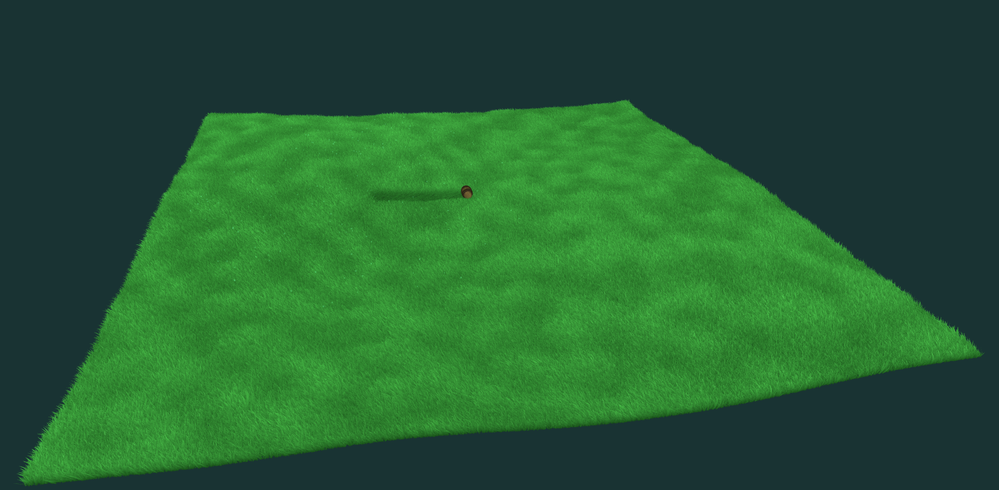
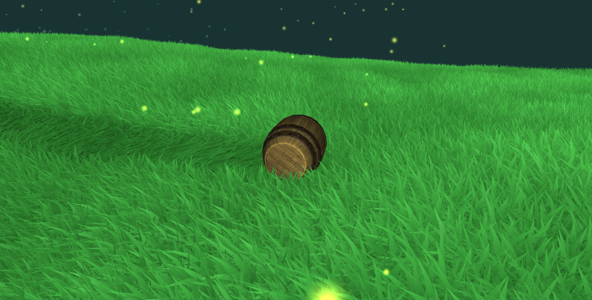
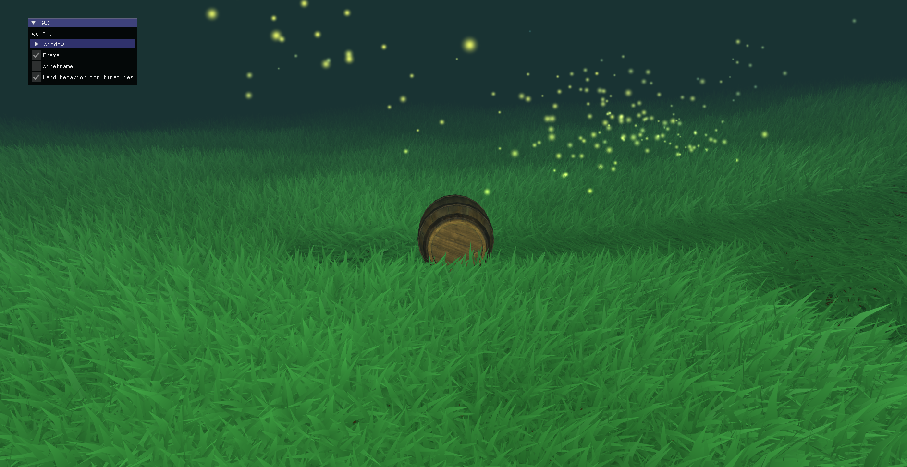

# Grass Trampling Simulator

An interactive 3D graphics application featuring a physics-driven barrel with real-time grass deformation, procedurally-generated terrain, and autonomous firefly swarm behaviors. Built as the final project for a Computer Graphics coursework using C++17, OpenGL 3.3, and advanced GPU optimization techniques.

Live demo:


**Key Highlights:**
- 🌾 **Highly Interactive Grass** — Real-time deformation with physics-based trampling and dynamic wind simulation
- 🎯 **Optimized Chunking & Instancing** — Efficient rendering of 80,000 grass instances per chunk with parallel background loading
- 🐛 **Realistic Boid Behaviors** — 250+ autonomous fireflies with spatial partitioning for authentic emergent swarm dynamics

---

## Table of Contents

1. [Features](#features)
2. [Demo & Screenshots](#demo--screenshots)
3. [Quick Start](#quick-start)
4. [Controls & Interaction](#controls--interaction)
5. [Architecture](#architecture)
6. [Implementation Highlights](#implementation-highlights)
7. [File Structure](#file-structure)
8. [Performance](#performance)

---

## Features

### Barrel Physics & Player Control
- **Gravity-based rolling mechanics** with terrain-aware acceleration and friction
- **Smooth barrel orientation** adapts to terrain normals for natural rolling behavior
- **Input-responsive movement** with intuitive directional control
- **Crush radius interaction** — barrel deforms grass in a configurable radius

**Physics Configuration:**
- Gravity: 7.5 m/s²
- Friction coefficient: 0.5
- Acceleration: 2.0 m/s²
- Barrel crush radius: 0.85 units

### Dynamic Grass Terrain
- **Real-time deformation** — grass responds immediately to barrel trampling
- **Persistent deformation** with gradual recovery simulating grass springiness
- **Wind animation** at 4.0 m/s with Perlin noise-based texture offset
- **Per-vertex height control** using GPU-computed size maps for efficient updates

### Procedurally-Generated Terrain
- **Chunked heightmap system** — 5×5 grid of active chunks, each 10×10 world units
- **Perlin noise generation** for natural-looking terrain variation
- **Dynamic LOD streaming** — chunks load/unload as the barrel moves
- **Parallel background loading** using `std::future` for seamless streaming
- **Memory-efficient caching** with on-demand Perlin noise computation

**Terrain Specs:**
- Chunk resolution: 64×64 heightmap pixels
- Active chunks: 25 (5×5 grid)
- Grass instances per chunk: 80,000 (hardware-instanced)
- Fog radius: 25 world units with smooth falloff

### Firefly Swarm Intelligence
- **250+ autonomous agents** with independent physics and behaviors
- **Spatial partitioning grid** (dynamic cell sizing) for efficient neighbor queries
- **Realistic boid behaviors:**
  - Separation: avoid crowding nearby fireflies
  - Alignment: match velocity with local neighbors
  - Cohesion: move toward the center of the swarm
  - Altitude stabilization: maintain preferred z-height
- **Swarm-level control** with follow-the-barrel target velocity
- **Optional herd behavior toggle** for visual demonstration (GUI)

### Camera System
- **Follow-camera controller** smoothly tracking the barrel position
- **Orbit-based camera** with rotation constraints (z-axis rotation)
- **Field of view:** 50° for immersive perspective
- **Frustum-based culling** (35° margin) for efficient rendering

### Interactive UI
- **ImGui interface** for real-time parameter toggling:
  - Frame axes visibility
  - Wireframe mode
  - Firefly herd behavior toggle
- **Console output** for performance monitoring and debug info

---

## Demo & Screenshots

### Running the Application
Execute the compiled binary to see the interactive scene. The barrel starts at the terrain center; use WASD to move and mouse to control camera.

**Visual Features to Observe:**
- Grass deformation trails following barrel movement
- Wind-driven grass animation across the entire terrain
- Firefly swarm adaptive behavior when toggled
- Smooth camera tracking and terrain streaming as you move

### Screenshots

**Wide terrain view showing 5×5 chunk grid:**


**Close-up of grass deformation showing height variation and wind animation:**


**ImGui controls & firefly swarm visualization:**


---

## Quick Start

### Prerequisites

| Platform | Requirements |
|----------|----------|
| **Windows** | [CMake](https://cmake.org/download/), [Visual Studio Community](https://visualstudio.microsoft.com/) (with "Desktop development with C++" module) |
| **macOS** | [CMake](https://cmake.org/download/), [Homebrew](https://brew.sh/), build tools |
| **Linux** | [CMake](https://cmake.org/download/), build-essential, pkg-config |

**Important:** The code directory path must not contain accents or spaces.

**Install Dependencies:**

**Linux (Ubuntu/Debian):**
```bash
sudo apt-get update
sudo apt-get install build-essential pkg-config cmake libglfw3-dev
```

**macOS (Homebrew):**
```bash
brew install cmake pkg-config ninja glfw
```

**Windows (MSVC):**
CMake and Visual Studio (with C++ workload) are required; GLFW dependencies are bundled.

### Build Instructions

**macOS & Linux (CMake):**
```bash
cmake --preset release          # Configure (debug/release/relwithdebinfo available)
cmake --build --preset release  # Compile
./project                        # Run
```

**Build Presets Available:**
- `debug` — Debug symbols, no optimizations (for debugging)
- `release` — Full optimizations, no debug info (recommended for performance)
- `relwithdebinfo` — Optimizations with debug symbols (recommended for development)

**macOS & Linux (Alternative: Makefile)**
```bash
make           # Builds to ./build/ and links to ./project
make run       # Compiles and runs the binary
make clean     # Removes build artifacts
```

**Windows (Visual Studio):**
```cmd
cmake --preset release
cmake --build --preset release
project.exe
```

**macOS-Specific: GLFW Linking Issue**

If GLFW is not found during compilation, set the precompiled option:
1. Edit `CMakeLists.txt` and change `MACOS_GLFW_PRECOMPILED` from `OFF` to `ON`
2. Open Finder and navigate to `cgp/third_party/glfw/macos/lib/libglfw.3.dylib`
3. Right-click → **Open** (to authorize the library)
4. Reconfigure and rebuild:
   ```bash
   cmake --preset release
   cmake --build --preset release
   ```

### Development Workflow (VS Code Recommended)

Open `vscode.code-workspace` in VS Code at the root of the project. When prompted, select **RelWithDebInfo** configuration for balanced debug/optimization compilation.

### First Run Verification
Upon launch, you should see:
1. Console output displaying camera control instructions and scene info
2. 3D window showing terrain with active fireflies
3. Barrel model at the center of the terrain
4. ImGui controls in the top-left corner

If the window doesn't appear or crashes, see [Troubleshooting](#troubleshooting).

---

## Controls & Interaction

### Keyboard Controls
| Key | Action |
|-----|--------|
| **W / A / S / D** | Move barrel forward/left/backward/right |
| **Shift** (hold) | Disable camera rotation (for UI interaction) |

### Mouse Controls
| Action | Effect |
|--------|--------|
| **Left Click + Drag** | Rotate camera around barrel |
| **Right Click + Drag (Vertical)** | Camera Zoom |

### ImGui Interface
Located in the top-left corner of the window:

```
☐ Frame          [Checkbox] Toggle global coordinate frame visibility
☐ Wireframe      [Checkbox] Enable wireframe rendering mode
☐ Herd behavior  [Checkbox] Toggle firefly swarm emergent behaviors
```

### Interactive Tips
1. **Explore terrain deformation:** Move the barrel in loops to see grass trampling patterns
2. **Observe wind effects:** Stop moving and watch grass animate from wind
3. **Test swarm behavior:** Enable "Herd behavior" to see fireflies converge and form swarm dynamically interacting with the barrel -> try to roll the barrel through the swarm and observe their avoidance behavior

---

## Architecture

### System Overview

```
┌─────────────────────────────────────────────────────────┐
│                   Scene Structure                       │
│              (Main Update/Render Loop)                  │
└─────────────────────────────────────────────────────────┘
           ↓              ↓              ↓
    ┌────────────┐  ┌──────────────┐  ┌────────────┐
    │  Barrel    │  │   Terrain    │  │  Firefly   │
    │ Controller │  │   System     │  │   Swarm    │
    └────────────┘  └──────────────┘  └────────────┘
           ↓              ↓              ↓
    • Physics        • Chunking      • Boid Behaviors
    • Input          • Grass Defs    • Spatial Grid
    • Collision      • Wind Sim      • Agent Update
```

### Subsystem Breakdown

#### 1. **BarrelController** (`src/subsystems/controller.hpp`)
**Responsibility:** Player character physics and rendering

**Key Components:**
- `mesh_drawable barrel` — 3D barrel model with PBR textures
- `vec3 smoothed_normal` — Terrain-aligned orientation
- `float vel` — Current rolling velocity
- `vec3 moving_dir` — Input direction vector

**Update Loop (per frame):**
1. Read WASD input and normalize to movement direction
2. Query terrain height at barrel position
3. Apply gravity, friction, and user acceleration
4. Update barrel orientation to match terrain surface normal
5. Notify `TerrainSystem` of trampling event if moved

**Rendering:**
- Uses PBR shader with normal/metallic-roughness maps
- Billboard scaling for consistent visibility

---

#### 2. **TerrainSystem** (`src/subsystems/terrain.hpp`)
**Responsibility:** Terrain generation, chunk streaming, grass rendering, and deformation

**Key Data Structures:**
```cpp
struct ActiveChunk {
    Chunk* chunk;                              // Heightmap + grass size data
    vec2 world_position;                       // Center in world space
    opengl_texture_image_structure heightmap;  // GPU texture for rendering
    opengl_texture_image_structure grass_size_map;  // Height variation per blade
    bool is_updating;                          // Parallel load flag
};

std::vector<ActiveChunk> active_chunks;        // Always 25 chunks (5×5)
std::unordered_map<...> memory;                // Cache all loaded chunks
std::vector<PendingTask> pending_tasks;        // Background loading queue
```

**Chunking Strategy:**
- **Fixed 5×5 grid** of active chunks centered on barrel (the size of the grid is customizable, but 5×5 provides a good balance between visual fidelity and performance)
- **10×10 world units per chunk** with 64×64 heightmap resolution
- **Perlin noise generation** on-demand when chunk loads
- **Background loading** via `std::future` to avoid frame stutter

**Grass Deformation Algorithm:**
1. **Trampling detection** — barrel within `crush_radius` triggers deformation
2. **Height reduction** — grass size reduced in circle around barrel
3. **Smooth falloff** — linear interpolation from crush center to radius edge
4. **Computing optimization** — Only updating the pixels within the affected radius, and only for concerned chunks

**Wind Simulation:**
- Perlin noise offset animates at `wind_speed` (4.0 m/s)
- `wind_scale` (250.0) controls texture coordinate multiplier
- Vertex shader applies wave animation with direction vector

---

#### 3. **FireflySwarm** (`src/subsystems/firefly.hpp`)
**Responsibility:** Multi-agent simulation, spatial partitioning, swarm rendering

**Spatial Partitioning Grid:**
```cpp
std::unordered_map<int, std::vector<Firefly*>> distribution;
// Maps grid cell index → list of fireflies in that cell
// Cells dynamically sized based on swarm spread
// Enables O(1) neighbor queries vs O(n²) brute force
```

**Boid Behavior Implementation:**
```cpp
struct Firefly {
    vec3 position;           // Global position
    vec3 velocity;           // Current velocity vector
    vec3 target_velocity;    // Desired velocity (from behaviors)
    float time_since_turn;   // For behavior state tracking
};
```

**Behaviors (per-frame update):**
1. **Separation (Repulsion)** — Avoid neighbors within 0.3 unit radius
   - Vector: Average away-vector from nearby fireflies
   - Weight: 1.0x influence

2. **Alignment (Flocking)** — Match velocity with local neighbors
   - Vector: Average velocity of neighborhood
   - Weight: 0.6x influence

3. **Cohesion (Attraction)** — Move toward neighborhood center
   - Vector: Average position - current position
   - Weight: 0.3x influence

4. **Altitude Stabilization** — Maintain z-height in the [0.6, 3.0] range
   - Vector: (0, 0, target_z - current_z)*weight
   - Weight: Gentler influence from the top than from the floor to prevent sinking

5. **Wandering** — Random jitter to prevent uniform movement
   - Vector: Uniform random vector updated every 0.5-1s
   - Weight: Small influence to add natural variation

6. **Boundary Avoidance** — Steer back toward swarm center if straying too far
   - Vector: Swarm center - current position
   - Weight: Increases with distance from swarm center

7. **Barrel Following** — Track barrel position with smooth velocity (at the swarm level, not individual)
   - Vector: Swarm center moves toward barrel
   - Weight: Gentle, non-intrusive guidance

8. **Barrel Avoidance** — Steer away if too close to barrel (within 0.5 units)
   - Vector: Current position - barrel position
   - Weight: Strong repulsion to prevent collision

**Update Sequence (per firefly, per frame):**
1. Update `target_velocity` every 0.5 to 1 second to add wandering effect while preventing jitter
2. Retrieve neighboring fireflies from adjacent cells
3. Compute weighted average of all behavior vectors
4. Smoothly interpolate `velocity` toward weighted average and `target_velocity`
5. Update position: `position += velocity * dt`

**Performance Optimization:**
- **Spatial grid cell size:** ~5m × 5m (tunable)
- **Neighbor search:** Only 8 adjacent cells checked (not entire swarm)
- **250 fireflies** update per frame with <1.5ms overhead

---

### Data Flow (Per-Frame Execution)

```
update_physics(dt, inputs)
  └─→ read_keyboard_input()
  └─→ query_terrain_height(barrel_pos)
  └─→ apply_gravity_and_friction()
  └─→ update_barrel_orientation()
  └─→ return moved_flag

if (moved):
  update_grass_trampling(barrel_pos, crush_radius, ...)
  └─→ for each active chunk:
      └─→ check_distance_to_trampling_center()
      └─→ reduce_grass_height_in_radius()
      └─→ upload_grass_size_map_to_GPU()

update_chunks(barrel_pos)
  └─→ determine_new_active_chunks()
  └─→ check_pending_tasks() → move to active_chunks if ready
  └─→ queue_new_chunks() → spawn std::future for Perlin generation

update_wind(t, dt)
  └─→ wind_offset += wind_dir * wind_speed * dt
  └─→ update shader uniform

update_firefly_swarm(dt, barrel_pos)
  └─→ regenerate_spatial_grid()
  └─→ for each firefly:
      └─→ compute_boid_behaviors()
      └─→ integrate_position()

draw_all_subsystems()
  └─→ terrain.draw() → render heightmap + grass instances
  └─→ player.draw() → render barrel model
  └─→ firefly_swarm.draw() → billboard particles
```

---

## Implementation Highlights

### 1. Grass Interactivity: Real-Time Deformation

**Challenge:** 80,000 grass instances per chunk must deform and recover in real-time without destroying frame rate.

**Solution:** Per-chunk GPU textures for grass size variation

**Performance Characteristics:**
- Texture updates: O(chunk_resolution²) = O(4096) operations per update
- GPU memory: 64×64 RG texture per chunk (angle + intensity) ≈ 32KB per chunk
- Frame time: <0.5ms per chunk update even with 25 active chunks

---

### 2. Chunking & Instancing: Optimized Rendering

**Challenge:** Render 5×5 km terrain with 80,000 grass blades per chunk without exceeding frame budget.

**Solution:** Chunking + hardware instancing + frustum culling + limited loading of new chunks per frame

**Memory Layout:**
- Heightmap: 64×64 RGB texture ≈ 48KB per chunk
- Grass size: 64×64 R texture ≈ 16KB per chunk
- Instance transforms: 80k × (vec3 pos + euler rot + scale) ≈ 2.2MB per chunk (streamed as needed) but same for all chunks

---

### 3. Firefly Boids: Optimized & Realistic Behaviors

**Challenge:** Simulate 250+ fireflies with realistic boid behaviors without O(n²) neighbor searches.

**Solution:** Spatial partitioning grid with dynamic cell sizing

**Complexity Analysis:**
- **Brute Force:** O(n²)
- **Spatial Grid:** O(nlog(n)) -> Scalse much better with more agents


**Visual Result:**
- Fireflies naturally avoid collision with each other
- Emergent flocking behavior without explicit scripting
- Smooth following of barrel with individual variation
- Toggle-able for coursework demonstration

---

## File Structure

```
root/
├── README.md                          # This file
├── CMakeLists.txt                     # CMake build configuration
├── CMakePresets.json                  # Build presets (debug/release)
├── Makefile                           # Alternative Unix build
├── project                            # Compiled executable
│
├── src/                               # Source code (C++)
│   ├── main.cpp                       # Entry point
│   ├── scene.hpp / scene.cpp          # Main scene orchestration
│   ├── application.hpp / .cpp         # Application framework wrapper
│   ├── environment.hpp / .cpp         # Shader environment constants
│   ├── camera_follow.hpp / .cpp       # Follow-camera controller
│   ├── grass.hpp / .cpp               # Grass rendering helpers
│   ├── utils.hpp / .cpp               # Utility functions
│   │
│   └── subsystems/                    # Core gameplay systems
│       ├── controller.hpp / .cpp      # Barrel physics & input
│       ├── terrain.hpp / .cpp         # Terrain, chunks, grass deformation
│       └── firefly.hpp / .cpp         # Firefly swarm behaviors
│
├── shaders/                           # GLSL Shaders
│   ├── terrain/                       # Heightmap terrain rendering
│   ├── grass/                         # Instanced grass with wind
│   ├── firefly/                       # Billboard particle rendering
│   ├── barrel/                        # PBR barrel model
│   └── single_color/                  # Debug shaders
│
├── assets/                            # 3D Models & Textures
│   ├── barrel/                        # Barrel model (OBJ) + textures
│   │   ├── barrel.obj                 # Geometry
│   │   ├── barrel_baseColor.png       # PBR base color
│   │   ├── barrel_normal.png          # Normal map
│   │   └── barrel_roughness.png       # Roughness map
│   ├── textures/                      # Terrain & environment textures
│   └── perlin_noise_512.png           # Pre-computed noise for wind simulation
│
├── cgp/                               # CGP Framework Library
│   ├── cgp.hpp                        # Main include file
│   ├── cgp_parameters.hpp             # Framework configuration
│   ├── 01_base/                       # Base linear algebra
│   ├── 02_numarray/                   # Array containers
│   ├── 09_geometric_transformation/   # Matrices, quaternions, transformations
│   ├── 13_opengl/                     # OpenGL wrappers (mesh, texture, shader)
│   ├── 16_drawable/                   # Drawable components
│   ├── 19_camera_controller/          # Camera control base classes
│   └── third_party/                   # External libraries (GLAD, ImGui, GLFW)
│
├── build/                             # Build artifacts (generated)
│   └── debug/ or release/             # Compiled object files & executables
│
├── scripts/                           # Build & deployment scripts
└── vscode.code-workspace              # VS Code workspace configuration
```

### Key File Roles

| File | Purpose | Lines |
|------|---------|-------|
| [scene.cpp](src/scene.cpp) | Main update/render loop orchestration | ~200 |
| [controller.hpp](src/subsystems/controller.hpp) | Barrel physics interface | ~20 |
| [terrain.hpp](src/subsystems/terrain.hpp) | Terrain system interface | ~45 |
| [firefly.hpp](src/subsystems/firefly.hpp) | Firefly swarm interface | ~30 |

---

## Performance

On a typical machine (RTX 4060 laptop, Intel i7-13620H), the application achieves:
- **Frame rate:** 60+ FPS (1080p, unlimited FPS)
- **GPU time:** ~12ms per frame
- **CPU time:** ~3ms per frame (including physics & boid updates). Controlled CPU spikes capped at ~10ms via throttled asynchronous chunk loading (maximum 2 chunks initialized per frame).

---

## Credits & References

- **CGP Library** — Custom Computer Graphics Programming framework developed for educational purposes
- **GLFW** — Windowing and input library
- **OpenGL** — Graphics rendering API
- **ImGui** — Immediate-mode GUI library
- **Perlin Noise** — Procedural terrain generation technique

---

## License

This project is part of a Computer Graphics coursework and is provided as-is for educational purposes.

---

**Last Updated:** May 2026  
**Status:** Final submission (complete and tested)  
**Build Status:** ✅ Compiles on Linux/macOS/Windows with CMake 3.16+
